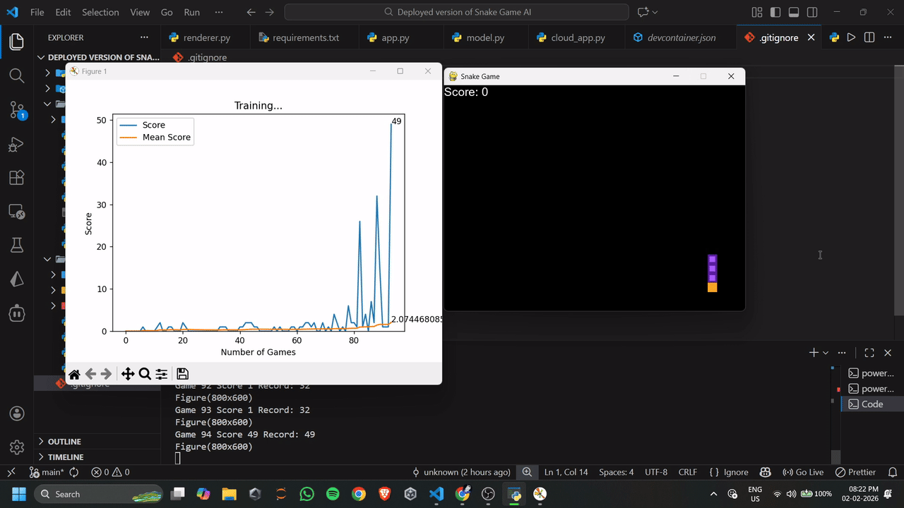

# Deep Q-Learning Snake AI

A Reinforcement Learning–based Snake game agent trained using **Deep Q-Learning (DQN)** and deployed with an interactive **Streamlit demo**.

This project demonstrates both **core RL concepts** and **real-world deployment constraints**, with separate implementations for local real-time execution and cloud-safe visualization.

---

## Demo



---

## **Live Demo (Streamlit Cloud):**  
https://snake-game-ai-abhisumat.streamlit.app/

> Due to Streamlit Cloud rendering limitations, the deployed version uses **step-based visualization** instead of continuous animation.  
> The **local version supports full real-time gameplay**.

---

## How It Works

- The agent is trained using **Deep Q-Learning**
- State space includes:
  - danger detection (straight / left / right)
  - current movement direction
  - relative food position
- Action space:
  - move straight
  - turn right
  - turn left
- Reward function encourages:
  - eating food
  - avoiding collisions
  - efficient movement

The trained policy consistently improves performance over time.

---

## Running Locally (Full Animation)

The local version supports continuous real-time animation of the trained agent and is intended for users who clone or fork the repository.

1. Clone the repository:
```bash
git clone https://github.com/abhisumat-kundu/snake-game-ai.git
cd snake-game-ai
```

2. Install dependencies
```bash
pip install -r requirements.txt
```

3. Run the application
```bash
streamlit run app.py
```

This version uses a real-time loop and renders every frame smoothly.

---

## Cloud Deployment (Streamlit Cloud)

The deployed version runs using cloud_app.py.

Due to Streamlit Cloud execution constraints, real-time animation loops are unreliable in production. To ensure stability, the cloud version:

- avoids continuous infinite loops
- uses step-based inference
- renders frames deterministically
- prevents dropped or skipped frames

This separation reflects production-level deployment constraints, not limitations of the trained model.

Live Demo:
https://snake-game-ai-abhisumat.streamlit.app/